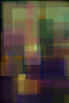

# mona_lisa_GA

| Target Image  | Result after 11030 generations |
| ------------- | ------------- |
|    |   |

This is a genetic algorithm for [Processing](https://processing.org/) which uses translucent squares to evolve towards recreating the Mona Lisa. It is based off of [Daniel Shiffman](https://www.youtube.com/c/TheCodingTrain)'s explanation of genetic algorithms.

The algorithm creates multiple 'PGraphics' buffers with rectangles of random size, position and color. The "fittest" (the closest match based on pixel values) graphics buffers will mate and produce the next population. The very fittest buffer is displayed on screen for each cycle. This process continues indefinitely.
